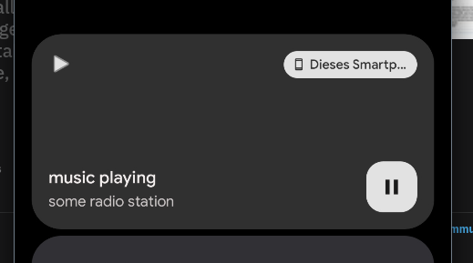

# Android Media control: notification and lock-screen audio player for Titanium SDK

## Installation

* download the module from [dist](https://github.com/m1ga/ti.mediacontrol/tree/main/android/dist)
* put the ZIP into you project root
* add `<module>ti.mediacontrol</module>` to your tiapp.xml `<modules>` section.

## Methods
* <b>createPlayer(options)</b>: creates a new player + notification.
  <b>Options:</b>
 * <b>showNext</b>: show the next button
 * <b>showPrevious</b>: show the previous button
 * <b>title</b>: first row (title)
 * <b>text</b>: second row (text)
 * <b>backgroundImage</b>: background image of the player
* <b>close()</b>: close the player/dismiss the notification.
* <b>updateInfo({title: "", text: ""})</b>: change both strings at the same time
* <b>play()</b>: puts the player into play mode
* <b>pause()</b>: puts the player into pause mode

## Properties
* <b>backgroundImage</b>: change the background image of the player
* <b>title</b>: change the first row (title)
* <b>text</b>: change the second row (text)

## Constants
* PLAY
* PAUSE
* NEXT
* PREVIOUS

## Events
* <b>changeStatus</b>: is fired when the status of the player changes. It will return `status` with one of the constants.

## Example

check [examples/app.js](https://github.com/m1ga/ti.mediacontrol/tree/main/example) for a full example.

## License

MIT

## Author

* Michael Gangolf
