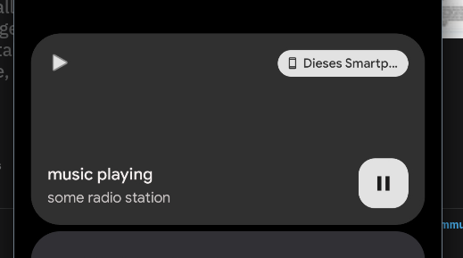

# Android Media control: notification and lock-screen audio player for Titanium SDK



## Installation

* download the module from [dist](https://github.com/m1ga/ti.mediacontrol/tree/main/android/dist)
* put the ZIP into your project root
* add `<module>ti.mediacontrol</module>` to your tiapp.xml `<modules>` section.

On Android 13+ the app has to request the notification permission at runtime before the player notification is shown:

```javascript
Ti.Android.requestPermissions(['android.permission.POST_NOTIFICATIONS'], function(e) {
	if (e.success) {
		// createPlayer() will show the notification now
	}
});
```

## Methods
* <b>createPlayer(options)</b>: creates a new player + notification.
  <b>Options:</b>
 * <b>showNext</b>: show the next button
 * <b>showPrevious</b>: show the previous button
 * <b>title</b>: first row (title)
 * <b>text</b>: second row (text)
 * <b>backgroundImage</b>: cover image of the player (notification large icon and album art)
 * <b>color</b>: colorize the notification with the given color (e.g. `"#00f"`)
 * <b>icon</b>: Android drawable resource id for the small notification icon
* <b>close()</b>: close the player/dismiss the notification. Fires a `changeStatus` event with `status: PAUSE` so the app can stop its audio playback.
* <b>updateInfo({title: "", text: ""})</b>: change both strings at the same time
* <b>play()</b>: puts the player into play mode. Fires a `changeStatus` event with `status: PLAY`.
* <b>pause()</b>: puts the player into pause mode. Fires a `changeStatus` event with `status: PAUSE`.

* <b>setMetadata(options)</b>: sets the track metadata. All keys are optional; only the passed keys are updated. On Android 13+ the system media controls display this metadata (not the notification title/text), so keep it up to date.
  <b>Options:</b>
 * <b>title</b>: Text
 * <b>artist</b>: Text
 * <b>album</b>: Text


## Properties
* <b>backgroundImage</b>: change the cover image of the player (updates the notification image and the album art)
* <b>title</b>: change the first row (title)
* <b>text</b>: change the second row (text)

## Constants
* PLAY
* PAUSE
* NEXT
* PREVIOUS

## Events
* <b>changeStatus</b>: is fired when the status of the player changes. It will return `status` with one of the constants.
* <b>keyPress</b>: is fired when a hardware media button (e.g. headset button) is received. It will return `keyCode` with the Android `KeyEvent` keycode.

## Example

check [examples/app.js](https://github.com/m1ga/ti.mediacontrol/tree/main/example) for a full example.

## License

MIT

## Author

* Michael Gangolf
